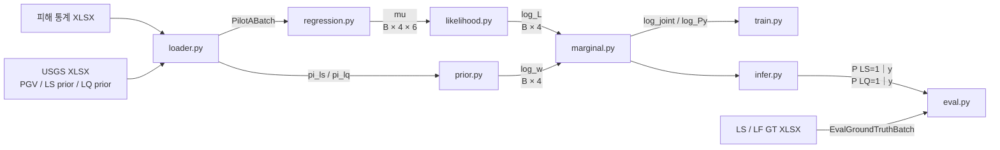
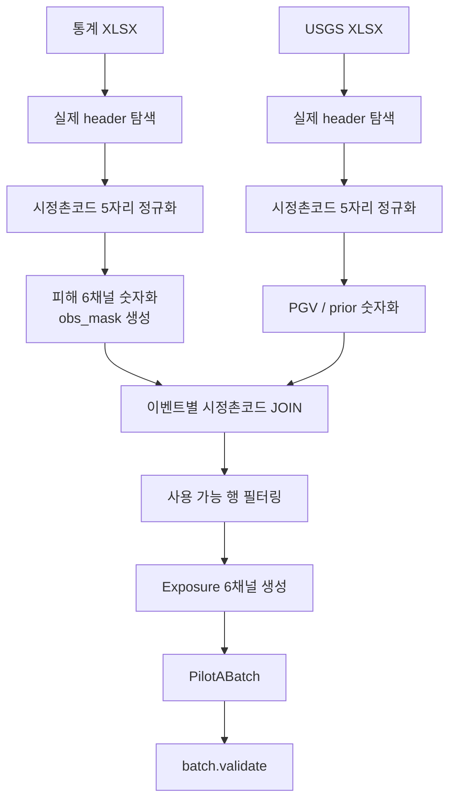
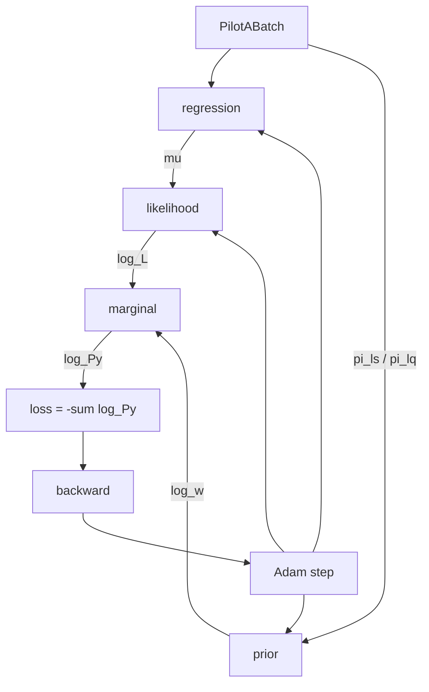

> ### 이 저장소에 대해
>
> `minji1217/pilotA`에서 **분리해 나온 개인 작업 저장소**입니다.
> 원본은 후배와 함께 쓰고 있어 같은 브랜치 이름이 서로 덮어써질 수 있었고,
> 그것을 피하려고 2026-09-16에 브랜치 25개를 커밋 해시 그대로 미러링했습니다.
>
> - **여기(`pilotA-minji`)**: 민지 쪽 작업. 앞으로의 커밋은 이쪽에 쌓입니다.
> - **원본(`pilotA`)**: 후배 쪽 작업. 분리 시점까지의 이력은 양쪽이 동일합니다.
>
> 데이터(`raw/`, `validation/`, `outputs/`)는 `.gitignore`에 있어 저장소에 포함되지 않습니다.
> 재현하려면 원천 xlsx 3개를 따로 넣고 `python tools/build_dataset.py --area-from-usgs`를 먼저 돌립니다.
>
> <details><summary><b>브랜치 지도 (25개)</b></summary>
>
> | 브랜치 | 내용 |
> |---|---|
> | `main` | 모델 코드 본체 (loader / prior / regression / likelihood / marginal / train / eval) |
> | `followup1-1-wood` | 후속실험 1 계열. 후속실험 3의 **"3번 기준"** — LQ prior를 **평균**으로 집계 |
> | `followup1-2-mtn`, `followup1-covariates` | 후속실험 1 계열 |
> | `followup2-1-wood` | 후속실험 2 계열. 후속실험 3의 **"6번 기준"** — LQ prior를 **최대**로 집계 |
> | `followup2-prior` | 후속실험 2 계열 |
> | `followup3-avg-b4`, `followup3-avg-b10` | 갈래 ② b 상한 넓히기 (평균집계 기반, b_max = 4 / 10) |
> | `followup3-lqmax-b10` | 갈래 ② b 상한 넓히기 (최대집계 기반, b_max = 10) |
> | `followup3-area-avg-fixed` / `-tied` / `-bounded` / `-free` | 갈래 ④ 면적 항 A · B · C · D |
> | `followup3-area-avg-a1-c05` / `-a1-c2` | 갈래 ④ 면적 항 E (c=0.5) · F (c=2) |
> | `followup3-area-avg-lq-c05` / `-lq-c075` / `-lq-c-free` | 갈래 ④ 면적 항 G · H · I (LQ의 c만 변경) |
> | `followup3-area-avg-b-only` | 갈래 ④ 면적 항 J (b만 학습) |
> | `followup3-area-avg-*-ctr` (4개) | 중심화를 이름으로 켜던 시절의 조건. 지금은 규칙으로 자동 적용되어 **원본과 결과가 완전히 같아** 실험 목록에서 뺐습니다 |
> | `claude/relaxed-johnson-iqxeyf` | 후속실험 3 러너(`run_followup3.py`)와 결과 문서(`docs/`) |
> | `claude/vigilant-wozniak-atum1b` | 이전 발표자료 작업 |
>
> 갈래 ②③④의 조건별 파라미터와 결과는
> `claude/relaxed-johnson-iqxeyf` 브랜치의 `docs/후속실험3_조건표.md`에 정리되어 있습니다.
>
> </details>

---

# Pilot A — Disaster Latent-State Probabilistic Model

> 지진 이벤트별 시정촌 피해 데이터와 USGS 사전확률(prior)을 결합해  
> **산사태(LS) / 액상화(LQ) 잠재상태를 확률적으로 추론하는 Pilot 구현**입니다.

---

## 1. 한눈에 보는 전체 구조

이 프로젝트의 핵심은 각 **시정촌 × 지진 이벤트** 행에 대해 다음 4개의 잠재상태를 모두 가정해 보는 것입니다.

| State | LS | LQ | 의미 |
|---|---:|---:|---|
| `00` | 0 | 0 | 산사태 없음 / 액상화 없음 |
| `10` | 1 | 0 | 산사태 있음 / 액상화 없음 |
| `01` | 0 | 1 | 산사태 없음 / 액상화 있음 |
| `11` | 1 | 1 | 산사태 있음 / 액상화 있음 |

각 상태에서 예상 피해량 `mu`를 만들고, 실제 피해 `y`가 그 상태에서 얼마나 그럴듯한지 Negative Binomial likelihood로 계산한 뒤, USGS prior와 결합해 최종 posterior를 구하는 구조입니다.



---

# 2. 코드 역할 분담

전체 구현은 크게 **데이터/피해 모델(A)** 과 **prior/학습/추론(B)** 흐름으로 나뉩니다.

```text
A 영역
schema.py
   ↓
loader.py
   ↓
regression.py
   ↓
likelihood.py
   ↓
log_L [B, 4]

B 영역
prior.py
   ↓
log_w [B, 4]

log_L + log_w
   ↓
marginal.py
   ↓
train.py / infer.py / eval.py
```

| 파일 | 핵심 역할 | 주요 입력 | 주요 출력 |
|---|---|---|---|
| `schema.py` | 전체 데이터 규약 정의 | - | `PilotABatch`, `EvalGroundTruthBatch` |
| `loader.py` | XLSX 전처리 및 Tensor 변환 | 통계 / USGS / GT XLSX | Batch 객체 |
| `regression.py` | 4상태 × 6채널 기대피해 계산 | `PilotABatch` | `mu [B,4,6]` |
| `likelihood.py` | 실제 피해가 각 상태에서 얼마나 그럴듯한지 계산 | `y`, `mu`, `phi` | `log_L [B,4]` |
| `prior.py` | USGS prior 보정 및 4상태 prior 생성 | `pi_ls`, `pi_lq` | `log_w [B,4]` |
| `marginal.py` | likelihood + prior 주변화 | `log_L`, `log_w` | `log_joint [B,4]`, `log_Py [B]` |
| `train.py` | 전체 파라미터 공동 학습 | 전체 Batch | 학습된 모델 |
| `infer.py` | LS/LQ posterior 계산 | `log_joint`, `log_Py` | `p_ls [B]`, `p_lq [B]` |
| `eval.py` | 예측확률과 GT 비교 | 예측 / GT | MSE(Brier score) |

---

# 3. 디렉토리 구조

## 3.1 현재 ZIP에 들어있는 구조

업로드된 코드 압축파일 자체는 현재 아래처럼 **flat 구조**입니다.

```text
pilotA-main/
├── schema.py
├── loader.py
├── regression.py
├── likelihood.py
├── prior.py
├── marginal.py
├── train.py
├── infer.py
├── eval.py
└── requirements.txt
```

다만 현재 코드의 import 문은 `data.schema`, `data.loader`, `data.regression`, `data.likelihood`를 사용하고 있습니다.

따라서 **현재 import 문을 그대로 유지한다면** 아래 구조가 가장 자연스럽습니다.

## 3.2 현재 import 기준 권장 구조

```text
pilotA/
├── data/
│   ├── __init__.py
│   ├── schema.py
│   ├── loader.py
│   ├── regression.py
│   └── likelihood.py
│
├── raw/
│   ├── 재난프로젝트_시정촌별_통계데이터.xlsx
│   ├── 재난프로젝트_시정촌별_USGS.xlsx
│   └── LS_LF 데이터자료.xlsx
│
├── prior.py
├── marginal.py
├── train.py
├── infer.py
├── eval.py
├── requirements.txt
└── README.md
```

> `loader.py`는 `from .schema import ...`를 사용하고, `train.py`는 `from data.loader import ...`를 사용하므로 `data/` 패키지에 두는 구조가 현재 코드와 맞습니다.

---

# 4. 입력 데이터

## 4.1 피해 통계 XLSX

모델에서 사용하는 6개 피해채널은 다음 순서로 고정됩니다.

```python
CHANNELS = (
    "death",
    "serious_injury",
    "minor_injury",
    "full_collapse",
    "half_collapse",
    "partial_damage",
)
```

| Tensor index | 모델 채널 | 실제 XLSX 컬럼 | Exposure |
|---:|---|---|---|
| 0 | `death` | 사망 | `population` |
| 1 | `serious_injury` | 중상 | `population` |
| 2 | `minor_injury` | 경상 | `population` |
| 3 | `full_collapse` | 전파 | `households_general` |
| 4 | `half_collapse` | 반파 | `households_general` |
| 5 | `partial_damage` | 일부파손 | `households_general` |

피해값이 `-`, `–`, `—`, 빈칸이면 실제 0건으로 처리하지 않습니다.

```text
원본 피해값 = 결측
       ↓
y = 0.0              # 계산용 placeholder
obs_mask = False      # 실제 관측값이 아님
```

따라서 **진짜 피해 0건**과 **결측을 임시로 넣은 0**을 구분할 수 있습니다.

---

## 4.2 USGS XLSX

모델에서 사용하는 값은 다음 3개입니다.

```text
LS_prior(평균) → pi_ls
LQ_prior(평균) → pi_lq
PGV            → pgv
```

Prior는 `[0, 1]` 범위를 허용하며, 0 또는 1도 원본 데이터로 유지합니다.

`prior.py`에서 logit 계산 시 `EPS=1e-6` 경계 처리를 사용합니다.

---

## 4.3 이벤트

현재 8개 지진 이벤트를 사용합니다.

```text
0  2004 니카타현주에쓰
1  2007 니카타현주에쓰오키
2  2008 이와테미야기
3  2016 구마모토
4  2018 오사카
5  2018 훗카이도
6  2021 후쿠시마
7  2024 노토반도
```

`event_idx`는 회귀모형에서 해당 행이 **어떤 이벤트 효과 `alpha_e`를 사용해야 하는지 선택하는 index**입니다.

---

# 5. Loader 파이프라인

`loader.py`는 Excel의 불규칙한 원본 구조를 모델이 바로 사용할 수 있는 Tensor Batch로 바꾸는 입구입니다.



### 현재 행 수 검증값

```text
통계 원본 행       : 403
USGS 매칭 행       : 383
최종 모델 사용 행  : 382
```

이 값은 모델 Batch 크기를 강제로 고정하는 값이 아니라 **현재 실제 파일 상태가 예상과 동일한지 확인하는 검증값**입니다.

---

# 6. PilotABatch

`loader.py`의 최종 모델 입력은 일반 DataFrame이 아니라 `PilotABatch` dataclass입니다.

```text
PilotABatch
├── y                  [B, 6]  float64
├── E                  [B, 6]  float64
├── pgv                [B]     float64
├── pi_ls              [B]     float64
├── pi_lq              [B]     float64
├── event_idx          [B]     int64
├── obs_mask           [B, 6]  bool
└── municipality_code  len(B)  tuple[str, ...]
```

현재 실제 데이터 기준:

```text
B = 382
```

즉:

```text
y.shape         = [382, 6]
E.shape         = [382, 6]
pgv.shape       = [382]
pi_ls.shape     = [382]
pi_lq.shape     = [382]
event_idx.shape = [382]
obs_mask.shape  = [382, 6]
```

---

# 7. 실제 한 행 예시 — 아쓰마초

2018 홋카이도 이벤트의 아쓰마초를 예로 들면 모델 입력은 다음 형태입니다.

```text
municipality_code = "01581"

y = [
    36,    # 사망
    0,     # 중상
    61,    # 경상
    224,   # 전파
    318,   # 반파
    1097   # 일부파손
]

population         = 4838
households_general = 2121

E = [
    4838, 4838, 4838,
    2121, 2121, 2121
]

PGV       = 44.64
pi_ls     = 0.00709
pi_lq     = 0.03162
event_idx = 5

obs_mask = [True, True, True, True, True, True]
```

이 **한 행이 regression에서 4개의 잠재상태로 확장**됩니다.

```text
아쓰마초 한 행
      │
      ├── 상태 00 → 6개 피해채널 mu
      ├── 상태 10 → 6개 피해채널 mu
      ├── 상태 01 → 6개 피해채널 mu
      └── 상태 11 → 6개 피해채널 mu

결과 shape = [4, 6]
```

---

# 8. Regression — 상태별 기대피해 `mu`

`regression.py`의 목적은 각 행을 4개 잠재상태로 확장한 뒤 6개 채널의 기대피해 평균 `mu`를 계산하는 것입니다.

## 8.1 회귀식

$$
\log \lambda_{ice}
=
\alpha_c
+ \alpha_e
+ \beta_c \log(PGV_{ie})
+ \gamma_c^{LS} LS
+ \gamma_c^{LQ} LQ
$$

$$
\lambda_{ice}=\exp(\log \lambda_{ice})
$$

$$
\mu_{ice}=E_{ice}\lambda_{ice}
$$

### 파라미터 의미

| 파라미터 | shape | 의미 |
|---|---:|---|
| `alpha_channel` | `[6]` | 피해채널별 기본 log 피해율 |
| `alpha_event` | `[8]` | 이벤트별 효과 |
| `beta_pgv` | `[6]` | 채널별 `log(PGV)` 효과 |
| `gamma_ls` | `[6]` | LS 발생 효과 |
| `gamma_lq` | `[6]` | LQ 발생 효과 |

기준 이벤트는 `reference_event_idx=0`이며 해당 `alpha_e`는 학습 중에도 0으로 고정됩니다.

## 8.2 초기값

```text
alpha_c
→ log(sum(y_c) / sum(E_c))

alpha_e
→ 0

beta_c
→ 0

gamma_ls
→ 0.1

gamma_lq
→ 0.1
```

`gamma_ls`, `gamma_lq`는 내부 unconstrained parameter를 학습하고 `softplus()`를 거쳐 항상 양수가 되도록 구현되어 있습니다.

## 8.3 출력 shape

```text
입력
E         [B, 6]
pgv       [B]
event_idx [B]

        ↓ regression.forward()

log_lambda [B, 4, 6]
lambda     [B, 4, 6]
mu         [B, 4, 6]
```

`mu[i, s, c]`는:

> **i번째 시정촌·이벤트 행이 s번째 잠재상태라고 가정했을 때 c번째 피해채널에서 기대되는 평균 피해 건수**

를 의미합니다.

---

# 9. Likelihood — 실제 피해가 얼마나 그럴듯한가

`likelihood.py`는 regression에서 만든 `mu`와 실제 피해 `y`를 Negative Binomial 분포로 비교합니다.

## 9.1 분포

$$
Y_{ice} \sim NegBin(\mu_{ice}, \phi_c)
$$

$$
Var(Y_{ice})
=
\mu_{ice}+\frac{\mu_{ice}^2}{\phi_c}
$$

`phi`는 행이나 상태별이 아니라 **피해채널별 1개씩** 존재합니다.

```text
mu  : [B, 4, 6]  → 행 × 상태 × 채널마다 다름
phi : [6]        → 채널별 공유
```

초기값:

```text
phi = [5, 5, 5, 5, 5, 5]
```

`phi` 역시 unconstrained parameter를 학습하고 `softplus()`를 거쳐 항상 0보다 크게 유지됩니다.

---

## 9.2 `y_broadcast`

실제 피해 `y`는 상태에 따라 달라지지 않습니다.

```text
y  [B, 6]
```

하지만 `mu`는 상태가 4개이므로:

```text
mu [B, 4, 6]
```

입니다.

따라서 상태 축을 하나 추가합니다.

```python
y_broadcast = batch.y.unsqueeze(1)
```

```text
[B, 6]
   ↓ unsqueeze(1)
[B, 1, 6]
```

이후 PyTorch broadcasting을 통해 **동일한 실제 피해 y를 00/10/01/11 네 상태의 mu와 각각 비교**합니다.

---

## 9.3 채널별 log-PMF

```python
log_p_nb = dist.log_prob(y_broadcast)
```

출력:

```text
log_p_nb [B, 4, 6]
```

한 칸의 의미:

```text
특정 행
× 특정 잠재상태
× 특정 피해채널

에서

해당 mu와 phi를 가진 Negative Binomial 분포가
실제 y를 얼마나 잘 설명하는가
```

---

## 9.4 6개 채널 결합

현재 모델은 **잠재상태와 입력값이 주어졌을 때 6개 피해채널이 조건부 독립**이라고 가정합니다.

원래 확률공간에서는:

$$
L_s
=
\prod_{c=1}^{6}
P_{NB}(y_c\mid\mu_{s,c},\phi_c)
$$

하지만 작은 확률을 직접 곱하면 수치적으로 불안정하기 때문에 log-space를 사용합니다.

$$
\log L_s
=
\sum_{c=1}^{6}
\log P_{NB}(y_c\mid\mu_{s,c},\phi_c)
$$

코드:

```python
log_L = masked_log_p_nb.sum(dim=-1)
```

shape 변화:

```text
log_p_nb [B, 4, 6]
        ↓ 6채널 sum
log_L    [B, 4]
```

즉 `log_L[i]`는:

```text
[
  log_L00,
  log_L10,
  log_L01,
  log_L11
]
```

이며 **실제 피해표 전체가 4개의 잠재상태 각각에서 얼마나 그럴듯한지** 나타냅니다.

---

# 10. Prior — USGS 사전확률 보정

`prior.py`는 USGS의 `pi_ls`, `pi_lq`를 그대로 최종 prior로 쓰지 않고 학습 가능한 보정을 적용합니다.

$$
p^{LS}
=
\sigma(a_{LS}\,logit(\pi^{LS})+b_{LS})
$$

$$
p^{LQ}
=
\sigma(a_{LQ}\,logit(\pi^{LQ})+b_{LQ})
$$

초기값:

```text
a_ls = 1
a_lq = 1
b_ls = 0
b_lq = 0
```

따라서 학습 시작 시에는 USGS prior를 거의 그대로 사용하고, 이후 데이터에 맞게 보정합니다.

4개 상태 weight는:

$$
w_{00}=(1-p^{LS})(1-p^{LQ})
$$

$$
w_{10}=p^{LS}(1-p^{LQ})
$$

$$
w_{01}=(1-p^{LS})p^{LQ}
$$

$$
w_{11}=p^{LS}p^{LQ}
$$

구현은 처음부터 log-space를 사용합니다.

```text
log_w [B, 4]
```

---

# 11. Marginalization — prior와 피해 evidence 결합

`marginal.py`에서는:

```python
log_wl = log_w + log_L
```

을 계산합니다.

이는 원래 확률공간의:

$$
w_s L_s
$$

에 해당합니다.

그 다음 4개 상태를 주변화합니다.

$$
P(y)
=
\sum_s w_sL_s
$$

log-space에서는:

```python
log_Py = torch.logsumexp(log_wl, dim=-1)
```

shape:

```text
log_w      [B, 4]
log_L      [B, 4]
   ↓
log_joint  [B, 4]
   ↓ logsumexp(state)
log_Py     [B]
```

---

# 12. Training

`train.py`는 A/B 모든 학습 파라미터를 하나의 Adam optimizer로 동시에 업데이트합니다.

```text
DamageRegression
├── alpha_channel       6
├── alpha_event_free    7
├── beta_pgv            6
├── gamma_ls            6
└── gamma_lq            6

DamageLikelihood
└── phi                 6

Prior
├── a                   2
└── b                   2

총 자유 파라미터 = 41개
```

학습 흐름:



현재 기본 설정:

```python
epochs = 3000
lr = 0.02
optimizer = Adam
```

Loss:

$$
Loss=-\sum_i \log P(y_i)
$$

즉 **전체 관측 피해 데이터의 marginal likelihood를 최대화**하도록 학습합니다.

---

# 13. Inference

학습이 끝난 뒤 원하는 것은 단순히 `P(y)`가 아니라:

```text
P(LS=1 | y)
P(LQ=1 | y)
```

입니다.

상태별 posterior는 개념적으로:

$$
P(s\mid y)
=
\frac{w_sL_s}{\sum_{s'}w_{s'}L_{s'}}
$$

LS가 1인 상태는:

```text
10, 11
```

LQ가 1인 상태는:

```text
01, 11
```

따라서:

$$
P(LS=1\mid y)=P(10\mid y)+P(11\mid y)
$$

$$
P(LQ=1\mid y)=P(01\mid y)+P(11\mid y)
$$

최종 shape:

```text
p_ls [B]
p_lq [B]
```

---

# 14. GT / Evaluation 데이터 처리

GT는 **학습에 절대 사용하지 않고 평가 전용**으로 분리합니다.

```text
학습 입력
PilotABatch

평가 정답
EvalGroundTruthBatch
```

## 14.1 LS GT 규칙

현재 확정 규칙:

```text
ls_area_ha > 0
→ gt_ls = 1

ls_area_ha == 0
→ gt_ls = 0

ls_area_ha = NaN / NA
→ LS 평가에서 제외
```

NaN은 Tensor에 직접 넣지 않고:

```text
gt_ls = 0              # placeholder
ls_eval_mask = False   # 실제 LS 평가에서 제외
```

로 관리합니다.

---

## 14.2 LF/LQ GT 규칙

```text
jshis_flag = 1
→ gt_lq = 1

jshis_flag = 0
→ gt_lq = 0

jshis_flag = NaN / NA
→ gt_lq = 0
```

즉 **LF는 NaN을 0으로 간주**합니다.

---

## 14.3 삿포로 코드 보정

LF GT에서는 삿포로가 구 단위:

```text
01101 ~ 01110
```

로 나뉘어 있지만 모델 통계는:

```text
01100 = 삿포로시
```

한 행입니다.

따라서 loader에서:

```text
01101~01110
    ↓
01100
    ↓
max(gt_lq)
```

로 집계합니다.

즉 10개 구 중 하나라도 `gt_lq=1`이면 삿포로시 전체 `gt_lq=1`로 평가합니다.

---

# 15. EvalGroundTruthBatch

```text
EvalGroundTruthBatch
├── model_row_idx       [B_eval] long
├── gt_ls               [B_eval] long
├── gt_lq               [B_eval] long
├── ls_eval_mask        [B_eval] bool
├── event_idx           [B_eval] long
└── municipality_code   len(B_eval)
```

`model_row_idx`는 전체 모델 posterior에서 GT와 대응하는 행을 바로 선택하기 위한 index입니다.

```python
posterior_ls_eval = posterior_ls[eval_gt.model_row_idx]
posterior_lq_eval = posterior_lq[eval_gt.model_row_idx]
```

LS는 추가로 mask를 적용합니다.

```python
mask = eval_gt.ls_eval_mask

posterior_ls_valid = posterior_ls_eval[mask]
gt_ls_valid = eval_gt.gt_ls[mask]
```

Joint state 평가도 LS가 존재하는 행에서만 수행해야 합니다.

```python
state_mask = eval_gt.ls_eval_mask

gt_state_valid = eval_gt.gt_state_idx[state_mask]
```

---

# 16. Shape 흐름 한 장 요약

```text
┌──────────────────────────────────────────────────────────────┐
│                         loader.py                            │
│                                                              │
│ y          [B,6]                                             │
│ E          [B,6]                                             │
│ PGV        [B]                                               │
│ pi_ls/lq   [B]                                               │
│ event_idx  [B]                                               │
└────────────────────────────┬─────────────────────────────────┘
                             │
                             ▼
┌──────────────────────────────────────────────────────────────┐
│                      regression.py                           │
│                                                              │
│             mu [B,4,6]                                      │
│                 │ │ │                                       │
│                 │ │ └─ 6 피해채널                           │
│                 │ └─── 4 잠재상태                           │
│                 └───── B 행                                 │
└────────────────────────────┬─────────────────────────────────┘
                             │
                             ▼
┌──────────────────────────────────────────────────────────────┐
│                      likelihood.py                           │
│                                                              │
│ log_p_nb [B,4,6]                                             │
│        ↓ 채널 합                                             │
│ log_L    [B,4]                                               │
└────────────────────────────┬─────────────────────────────────┘
                             │
                  ┌──────────┴──────────┐
                  │                     │
                  ▼                     ▼
         prior.py log_w [B,4]      likelihood log_L [B,4]
                  │                     │
                  └──────────┬──────────┘
                             ▼
┌──────────────────────────────────────────────────────────────┐
│                       marginal.py                            │
│                                                              │
│ log_joint [B,4]                                              │
│ log_Py    [B]                                                │
└────────────────────────────┬─────────────────────────────────┘
                             │
                  ┌──────────┴──────────┐
                  ▼                     ▼
             train.py               infer.py
                  │                     │
            scalar loss            p_ls [B]
                                   p_lq [B]
                                        │
                                        ▼
                                     eval.py
```

---

# 17. 각 값의 의미 빠른 정리

| 값 | shape | 의미 |
|---|---:|---|
| `y` | `[B,6]` | 실제 관측 피해 건수 |
| `E` | `[B,6]` | 피해채널별 Exposure |
| `PGV` | `[B]` | 시정촌×이벤트별 지진동 크기 |
| `pi_ls` | `[B]` | USGS LS prior |
| `pi_lq` | `[B]` | USGS LQ prior |
| `event_idx` | `[B]` | 이벤트 효과 선택용 index |
| `mu` | `[B,4,6]` | 상태별 기대 피해 평균 |
| `phi` | `[6]` | 피해채널별 NB 과분산 모수 |
| `log_p_nb` | `[B,4,6]` | 상태×채널 단위 log-PMF |
| `log_L` | `[B,4]` | 실제 피해표 전체의 상태별 log-likelihood |
| `log_w` | `[B,4]` | 4개 잠재상태의 log prior |
| `log_joint` | `[B,4]` | `log_w + log_L` |
| `log_Py` | `[B]` | 상태를 주변화한 데이터 log probability |
| `p_ls` | `[B]` | 최종 `P(LS=1｜y)` |
| `p_lq` | `[B]` | 최종 `P(LQ=1｜y)` |

---

# 18. 핵심 개념을 한 문장씩

### Regression

> **각 잠재상태를 가정했을 때 피해가 평균적으로 얼마나 발생할지 `mu`를 만든다.**

### Likelihood

> **그 `mu`를 가진 피해분포가 실제 피해 `y`를 얼마나 잘 설명하는지 평가한다.**

### Prior

> **USGS가 피해 데이터를 보기 전에 각 LS/LQ 상태가 얼마나 가능하다고 보는지 나타낸다.**

### Marginal

> **피해 evidence와 USGS prior를 합쳐 전체 데이터 확률을 만든다.**

### Posterior

> **prior와 실제 피해를 모두 고려했을 때 LS/LQ가 발생했을 최종 확률이다.**

---

# 19. 실행 예시

현재 `train.py`의 경로 기준으로 원본 XLSX를 `raw/`에 둔 경우:

```bash
python train.py
```

내부적으로는 다음 순서로 실행됩니다.

```python
batch = load_pilot_a_batch(
    "raw/재난프로젝트_시정촌별_통계데이터.xlsx",
    "raw/재난프로젝트_시정촌별_USGS.xlsx",
)

reg, like, pri = train(batch=batch)

out_r = reg(batch)
out_l = like(batch, out_r.mu)
log_w = pri(batch.pi_ls, batch.pi_lq)

log_joint, log_Py = marginalize(
    log_w,
    out_l.log_L,
)

p_ls, p_lq = infer(
    log_joint,
    log_Py,
)
```

GT까지 함께 로드하려면 `loader.py`의 다음 진입점을 사용합니다.

```python
model_batch, eval_gt = load_eval_inputs(
    "raw/재난프로젝트_시정촌별_통계데이터.xlsx",
    "raw/재난프로젝트_시정촌별_USGS.xlsx",
    "raw/LS_LF 데이터자료.xlsx",
)
```

---

# 20. 현재 구현 기준 확인이 필요한 부분

아래는 업로드된 코드에서 **현재 구현 상태 그대로 확인되는 연결 이슈**입니다. README에서는 모델 의도와 실제 코드 상태를 구분하기 위해 명시합니다.

## 20.1 실제 ZIP 구조와 import 경로

ZIP은 모든 `.py`가 루트에 있지만 현재 코드는 다음 import를 사용합니다.

```python
from data.schema import ...
from data.loader import ...
from data.regression import ...
from data.likelihood import ...
```

따라서 실제 실행 시에는 앞에서 제시한 것처럼 `data/` 패키지 구조로 정리하거나 import 문을 통일해야 합니다.

---

## 20.2 `infer.py` log-space posterior 계산 확인 필요

현재 코드에는 다음과 같이 작성되어 있습니다.

```python
log_p_ls = torch.logsumexp(log_joint[:, LS_ON], dim=-1) / log_Py
log_p_lq = torch.logsumexp(log_joint[:, LQ_ON], dim=-1) / log_Py
```

하지만 posterior의 원래 확률공간 연산은:

```text
분자 / P(y)
```

이고, log-space에서는 나눗셈이 **뺄셈**으로 바뀌므로 이 부분은 실행 전 수식과 구현을 다시 확인해야 합니다.

---

## 20.3 `eval.py`와 최신 GT Batch 연결

현재 `loader.py` / `schema.py`는 최신 GT 구조인:

```text
EvalGroundTruthBatch
- gt_ls
- gt_lq
- ls_eval_mask
- model_row_idx
```

를 준비합니다.

반면 현재 `eval.py`는 아직 DataFrame 형태:

```text
muni_code
ls_true
lq_true
p_ls
p_lq
```

를 직접 merge하는 방식입니다.

따라서 **LS NaN 제외 정책(`ls_eval_mask`)까지 최종 평가에 반영하려면 eval 연결부는 추가 정리가 필요합니다.**

---

# 21. 최종 파이프라인 요약

```text
[피해통계 XLSX] ───────┐
                       ├─ loader.py
[USGS XLSX] ───────────┘
                           │
                           ▼
                      PilotABatch
                           │
             ┌─────────────┴─────────────┐
             │                           │
             ▼                           ▼
       regression.py                 prior.py
             │                           │
        mu [B,4,6]                  log_w [B,4]
             │                           │
             ▼                           │
       likelihood.py                     │
             │                           │
        log_L [B,4]                      │
             │                           │
             └─────────────┬─────────────┘
                           ▼
                      marginal.py
                           │
               ┌───────────┴───────────┐
               │                       │
               ▼                       ▼
          log_Py [B]             log_joint [B,4]
               │                       │
               ▼                       ▼
           train.py                 infer.py
                                       │
                              ┌────────┴────────┐
                              ▼                 ▼
                         P(LS=1|y)         P(LQ=1|y)
                              │                 │
                              └────────┬────────┘
                                       ▼
                                     eval
                                       ▲
                                       │
                          LS / LF Ground Truth
```

---

## TL;DR

> **각 시정촌의 실제 피해를 4개의 LS/LQ 잠재상태에서 각각 설명해 보고, 피해 likelihood와 USGS prior를 결합하여 LS/LQ posterior를 학습·추론하는 확률모형이다.**

